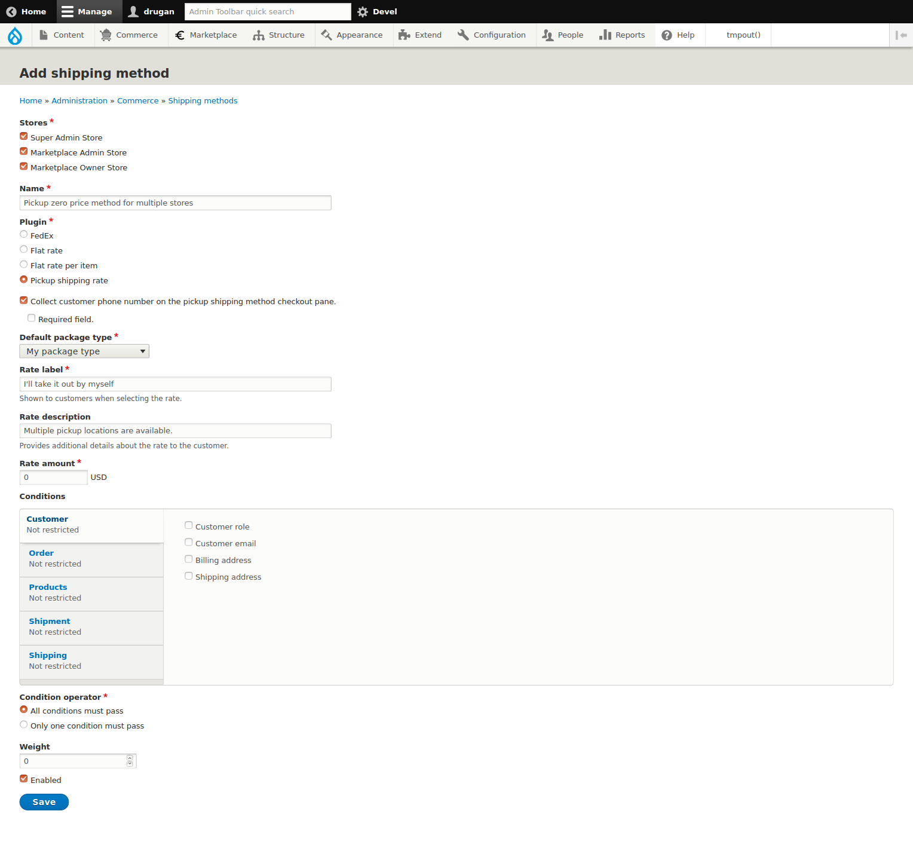
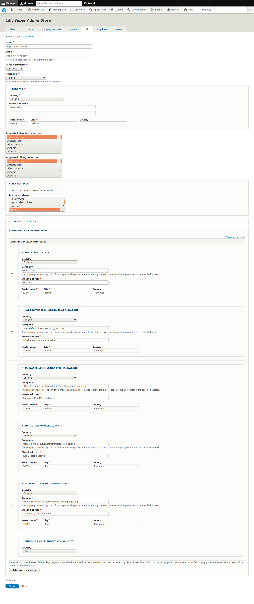
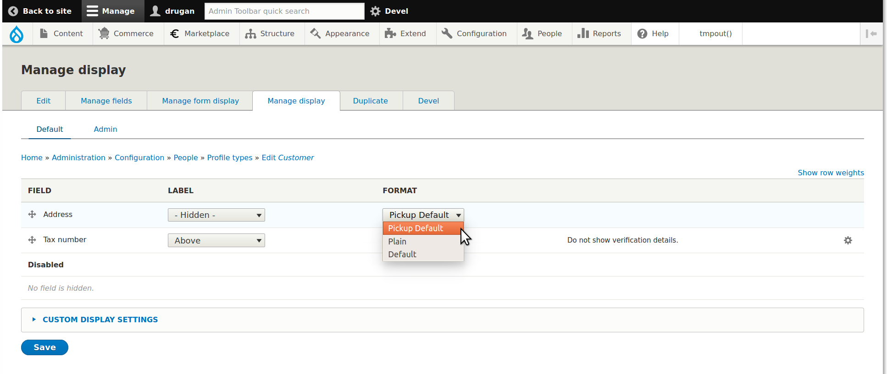
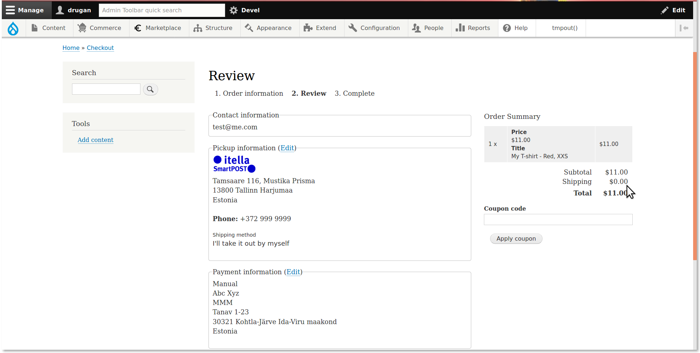
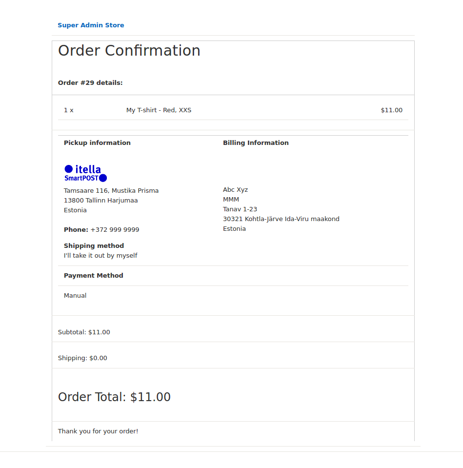
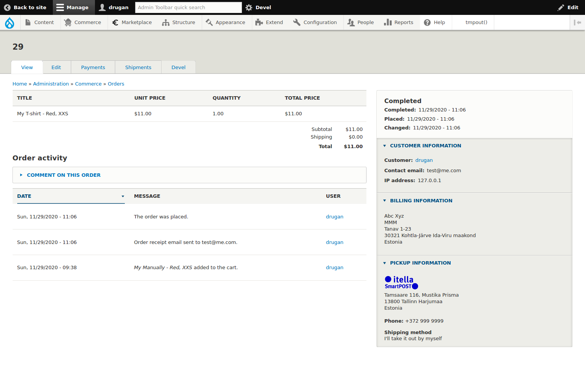
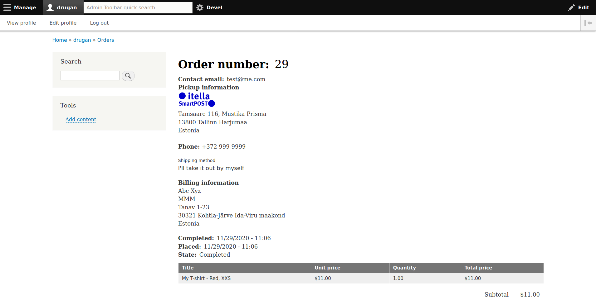

Commerce Pickup
=============

Provides a shipping method allowing customers to select a pickup point
address instead of entering their own shipping address on
the *Pickup information* checkout pane.

Multiple pickup addresses can be defined on a *Drupal Commerce* store edit page.
If there is no *SHIPPING PICKUP ADDRESSES* defined then the store main address
will be used as a default pickup point.

________________________________________________________________________________

- [Commerce Pickup on drupal.org ↗](https://www.drupal.org/project/commerce_pickup)
- [Commerce Pickup on github.com ↗](https://github.com/drugan/commerce_pickup)
- [#pickup-shipping-rate](#pickup-shipping-rate "Pickup shipping rate")
- [#shipping-pickup-addresses](#shipping-pickup-addresses "SHIPPING PICKUP ADDRESSES")
- [#pickup-default-formatter](#pickup-default-formatter "Pickup default formatter")
- [#pickup-information-checkout-order-information-step](#pickup-information-checkout-order-information-step "Pickup information checkout Order information step")
- [#pickup-information-checkout-review-step](#pickup-information-checkout-review-step "Pickup information checkout Review step")
- [#pickup-information-customer-order-receipt](#pickup-information-customer-order-receipt "Pickup information customer order receipt")
- [#pickup-information-admin-order-view](#pickup-information-admin-order-view "Pickup information admin order view")
- [#pickup-information-user-order-view](#pickup-information-admin-user-view "Pickup information admin user view")

________________________________________________________________________________

## Pickup shipping rate

After installing the module go to the 
[admin/commerce/shipping-methods/add#](#0 "/admin/commerce/shipping-methods/add")
page and create an instance of the *Pickup shipping rate* shipping method for a
desirable store(s).

Usually store owners don't charge any price when a customer takes the purchase
out by themselves from a pickup point. So, put **0** price into
the *Rate amount* field. Though obviously you can charge any price for this type
of a shipping method.

For example, you might be using different parcel machine vendors in your area to
deliver a purchase to the most suitable for a customer pickup point. If that
is the case then you possibly would want to compensate expenses on a parcel
machine.

Optionally you can enable *Phone* field on the *Pickup information* checkout
pane. The phone number is required by parcel machine vendors to automatically
send CMS to a customer when their purchase is ready to pickup.

Also, you can set up any of the *Drupal Commerce* conditions available for the
method.




________________________________________________________________________________


## SHIPPING PICKUP ADDRESSES

If your store main address is not suitable for a pickup point or you want
to provide multiple pickup points choice then you need to define at least one
of the *SHIPPING PICKUP ADDRESSES* on the
[store/1/edit#](#0 "Edit Store") page.

In the *Company* field of an address you can also enter either relative or
absolute image `URL` which will be displayed in a `Pickup information`
pane on the checkout *Review* step, order receipt and admin or user view of
an order. Note that image will be resized to three sizes of a page text size so
there is no need for too big images in the `URL`.

To reorder addresses just grab the crosshair handle in the left of an address
and drag-n-drop it in a new place and then save the form. **Tip:** before
reordering save the form and then reopen it again so the *Address* fieldsets
will be collapsed and much easier to drag-n-drop.

To remove an address just select `- None -` option in the *Country* field of an
address and then save the form.




________________________________________________________________________________


## Pickup default formatter

In order to properly display pickup point images and phone number you need to
enable `Pickup default` formatter for *Address* field of the *Customer* profile
type both for `Default` and `Admin` view modes.




________________________________________________________________________________


## Pickup information checkout Order information step


________________________________________________________________________________


## Pickup information checkout Review step



________________________________________________________________________________


## Pickup information customer order receipt



________________________________________________________________________________


## Pickup information admin order view



________________________________________________________________________________


## Pickup information user order view



________________________________________________________________________________


###### Module author:
```
  Vlad Proshin (drugan)
  [proshins@gmail.com](proshins@gmail.com)
  [https://drupal.org/u/drugan](https://drupal.org/u/drugan)
```
