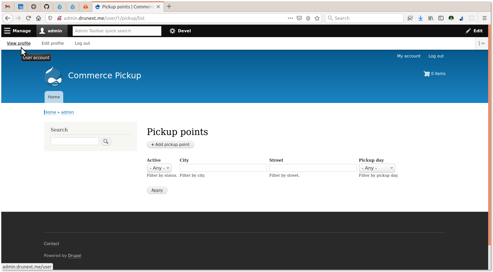

Commerce Pickup
===============

Provides a shipping method allowing customers to select a pickup point
address instead of entering their own shipping address on the
*Pickup information* checkout pane.

Multiple *Pickup* profiles can be created by multiple vendors (Pickup point
provider). By default, profile includes the pickup point address, timezone and
office hours fields. Optionally, the
[Simple Google Maps 竊余(https://www.drupal.org/project/simple_gmap) module can be
installed to display pickup point location on a map.

________________________________________________________________________________

- [Commerce Pickup on drupal.org 竊余(https://www.drupal.org/project/commerce_pickup)
- [Commerce Pickup on github.com 竊余(https://github.com/drugan/commerce_pickup)
- [Commerce Pickup on youtube.com 竊余(https://www.youtube.com/watch?v=wiJkbQu_ffc)

[[_TOC_]]
________________________________________________________________________________

## Installation

```bash
composer require drupal/commerce_pickup
drush en commerce_pickup
```

After installing the module assign the *Pickup vendor* role to a user(s) who
will administer their own pickup point profiles.

## Pickup profiles

Press the `Pickup` tab under the *Pickup vendor* user profile and then press
the `Add pickup point` button to create the very first pickup point profile.
After the profile is created you can use multiple VBO actions to duplicate and
modify existing profiles.



## Pickup shipping method

After installing the module go to the 
[admin/commerce/shipping-methods/add#](#0 "/admin/commerce/shipping-methods/add")
page and create an instance of the *Pickup shipping rate* shipping method for a
desirable store(s).

Optionally you can enable *Phone* field on the *Pickup information* checkout
pane. The phone number is required by parcel machine vendors to automatically
send CMS to a customer when their purchase is ready to pickup.

Also, you can set up any of the *Drupal Commerce* conditions available for the
method.


________________________________________________________________________________


###### The 1.0.x branch author:
```
  Vlad Proshin (drugan)
  [proshins@gmail.com](proshins@gmail.com)
  [https://drupal.org/u/drugan](https://drupal.org/u/drugan)
```
